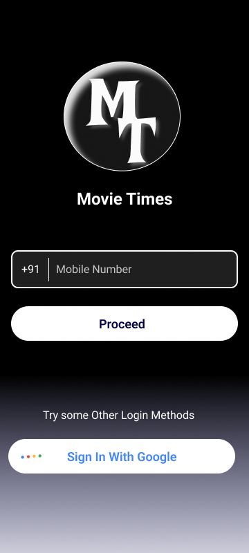
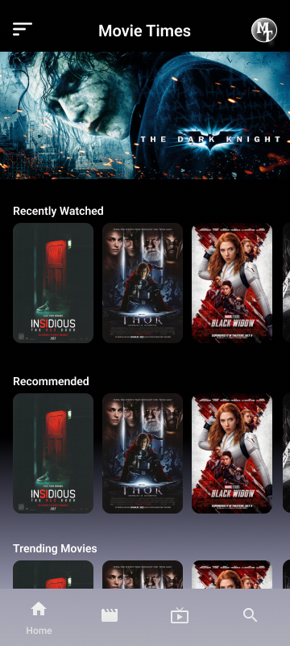
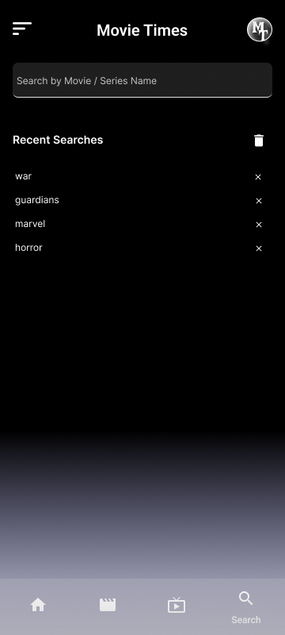
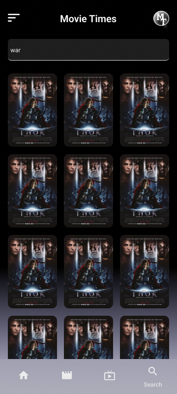
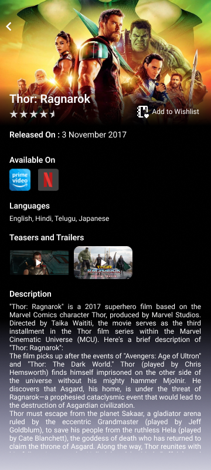
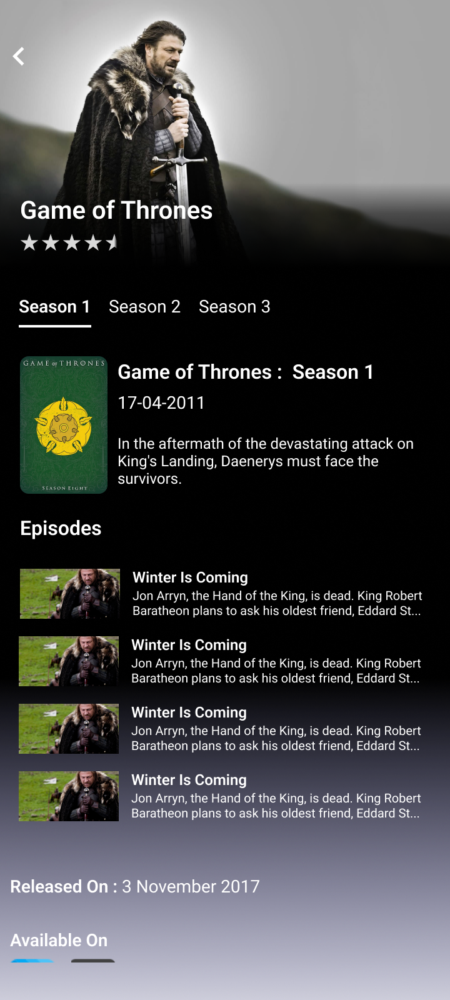

# MovieTimes

MovieTimes is a mobile application that allows users to discover and explore movies and TV shows easily. It provides a user-friendly interface to browse through various genres, view movie details, watch trailers, and add movies to the wishlist.

### Features
  
- Browse Trending Movies and TV Shows
- Filter Movies and TV Shows by Genres
- View Movie Details and Synopsis
- Watch Trailers of Movies
- Add Movies to Wishlist
- Architecture MVC model.

### Screenshots

      
    

## Tech Stack
- Java with Android SDK for development.
- Retrofit, Glide library implementation.
- RESTful APIs for fetching movie, series data.
- YouTube API for trailer integration.
- SQLite database as local database for watchLists and searchQuery management.
- Firebase Authentication for secure user login.
- Material Design components for an intuitive user interface.

## Development Phases.

#### Phase 1: *SplashScreen, LoginActivity, BottomSheetDialog*

'Phone & GoogleSignIn' Authentication using Firebase Database.

* 1.0. Phone Authentication: Authorization with mobile Number with OTP verification. 
* 1.1. GoogleSign In: Google Account Sign In.

#### Phase 2: Customise **BottomNavigation** using menu items with supportive fragments.

* 2.0. Bottom Navigation:

      The BottomNavigation View using menu items and frameLayout Manager to switch fragments with
      respect to menu Id.

#### Phase 3: _(HomeFragment, MovieFragment, SeriesFragment, SearchFragment)_ *API Implementation*

Creation of POJO class, Adapter and custom layout. 

* 3.0. SearchFragment:

      This Page has (MIX - API call) to SearchBar for mix search - movie/series/people/genres and recent search
      history, and search result implentations.

#### Phase 4: *SeriesDetailsActivity and MovieDetailsActivity*
    

Using generic interface for OnItemClicked method to fetch data from ITEM_ID

#### Phase 5: _*Layout Design and Data Handling*_
    

API Implementation, Adapter, Implicit & Explicit Intent, Collapsing Toolbar, Fetching Season and episode details.

#### Phase 6: *Local Database  log_out feature.*

* WishList management - SearchQuery recent and result management using SQLite database handling's with UI.
* Log_out feature in update with Navigation Drawer.

#### Phase 7: *Updates*

* Upcoming Updates: *Kotlin, LiveData, ViewModel, Navigation Drawer*
